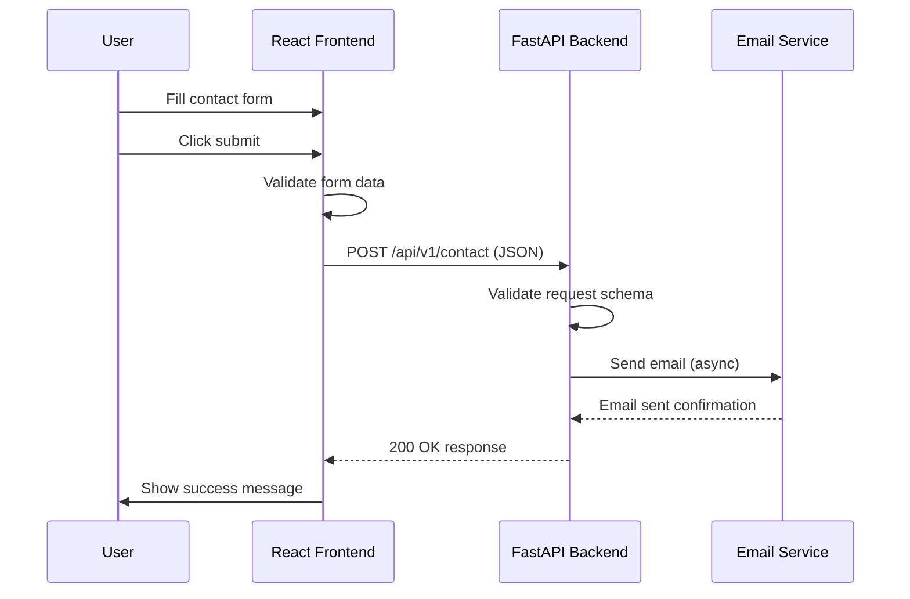

# Full-Stack Portfolio Project Architecture

## Project Overview
This document outlines the architecture for migrating the current HTML/CSS/JS portfolio to a React + Vite frontend with FastAPI backend.

---

## 1. Project Directory Structure

```
portfolio/
├── frontend/                    # React + Vite application
│   ├── public/
│   │   └── favicon.ico
│   ├── src/
│   │   ├── assets/
│   │   │   └── images/
│   │   ├── components/
│   │   │   ├── common/
│   │   │   │   ├── Button.jsx
│   │   │   │   ├── Section.jsx
│   │   │   │   └── Loader.jsx
│   │   │   ├── Header/
│   │   │   │   ├── Header.jsx
│   │   │   │   └── Navbar.jsx
│   │   │   ├── Hero/
│   │   │   │   └── Hero.jsx
│   │   │   ├── About/
│   │   │   │   ├── About.jsx
│   │   │   │   └── Stats.jsx
│   │   │   ├── Skills/
│   │   │   │   ├── Skills.jsx
│   │   │   │   └── SkillBar.jsx
│   │   │   ├── Projects/
│   │   │   │   ├── Projects.jsx
│   │   │   │   └── ProjectCard.jsx
│   │   │   ├── Contact/
│   │   │   │   ├── Contact.jsx
│   │   │   │   ├── ContactForm.jsx
│   │   │   │   └── ContactInfo.jsx
│   │   │   └── Footer/
│   │   │       └── Footer.jsx
│   │   ├── hooks/
│   │   │   ├── useScrollAnimation.js
│   │   │   └── useForm.js
│   │   ├── services/
│   │   │   └── api.js
│   │   ├── styles/
│   │   │   ├── variables.css
│   │   │   ├── global.css
│   │   │   └── components/
│   │   ├── App.jsx
│   │   ├── main.jsx
│   │   └── index.css
│   ├── index.html
│   ├── package.json
│   ├── vite.config.js
│   └── .env
├── backend/                     # FastAPI application
│   ├── app/
│   │   ├── api/
│   │   │   └── v1/
│   │   │       └── endpoints/
│   │   │           └── contact.py
│   │   ├── core/
│   │   │   ├── config.py
│   │   │   └── security.py
│   │   ├── schemas/
│   │   │   └── contact.py
│   │   ├── services/
│   │   │   └── email_service.py
│   │   ├── models/
│   │   │   └── main.py
│   ├── .env
│   ├── requirements.txt
│   └── run.py
└── README.md
```

---

## 2. Technology Stack

### Frontend
| Technology | Version | Purpose |
|------------|---------|---------|
| React | ^18.2.0 | UI Framework |
| Vite | ^5.0.0 | Build Tool |
| GSAP | ^3.12.0 | Animations |
| React Router DOM | ^6.20.0 | Routing |
| Axios | ^1.6.0 | HTTP Client |
| React Icons | ^4.12.0 | Icon Library |

### Backend
| Technology | Version | Purpose |
|------------|---------|---------|
| FastAPI | ^0.104.0 | Web Framework |
| Uvicorn | ^0.24.0 | ASGI Server |
| Pydantic | ^2.5.0 | Data Validation |
| python-dotenv | ^1.0.0 | Environment Variables |
| aiosmtplib | ^3.0.0 | Async SMTP |

---

## 3. Frontend Components Breakdown

### 3.1 Component Hierarchy

```
App
├── Header
│   └── Navbar
│       └── MobileMenu
├── Hero
│   ├── HeroContent
│   └── HeroBackground
├── About
│   ├── AboutContent
│   └── Stats
├── Skills
│   ├── SkillsCategory (x2)
│   └── SkillBar (x8)
├── Projects
│   ├── ProjectsGrid
│   └── ProjectCard (x6)
├── Contact
│   ├── ContactInfo
│   └── ContactForm
└── Footer
    └── SocialLinks
```

### 3.2 GSAP Animation Strategy

```javascript
// Animation Types
1. Hero Section
   - Text fade-in with stagger (0.2s delay between lines)
   - SVG shape scale animation
   - Button slide-up animation

2. About Section
   - Stats counter animation (0 to 15+, 0 to 2+)
   - Profile image reveal

3. Skills Section
   - ScrollTrigger: skill bars animate from 0% to target width
   - Staggered reveal per skill category

4. Projects Section
   - ScrollTrigger: cards fade in with stagger (0.1s per card)
   - Hover: scale(1.05) with shadow increase

5. Contact Section
   - Form fields slide in sequentially
   - Success message animation
```

---

## 4. Backend API Endpoints Design

### 4.1 Contact Endpoint

**Request**
```http
POST /api/v1/contact
Content-Type: application/json

{
  "name": "string (required, min 2 chars)",
  "email": "string (required, valid email)",
  "subject": "string (required, min 5 chars)",
  "message": "string (required, min 10 chars)"
}
```

**Success Response (200)**
```json
{
  "success": true,
  "message": "Email sent successfully",
  "data": {
    "id": "uuid",
    "timestamp": "ISO 8601 datetime"
  }
}
```

### 4.2 Email Service Configuration

```
SMTP_HOST=smtp.gmail.com
SMTP_PORT=587
SMTP_USER=your-email@gmail.com
SMTP_PASSWORD=your-app-password
FROM_EMAIL=your-email@gmail.com
TO_EMAIL=ivanbayigabogmis0@gmail.com
```

---

## 5. Data Flow



---

## 6. Skills Data

| Category | Skill | Level |
|----------|-------|-------|
| Programming | C++ | 90% |
| Programming | Python | 85% |
| Programming | JavaScript | 80% |
| Programming | Java | 75% |
| Technologies | Django | 85% |
| Technologies | React | 80% |
| Technologies | Qt | 75% |
| Technologies | Git & Docker | 85% |

---

## 7. Projects Data

1. **Jeu de cartes** - Card game with Qt/C++
2. **Application de lecture musicale** - Music player with C++/Qt
3. **Jeu du serpent** - Snake game with Python/Pygame
4. **ERP pour école** - School ERP with Django/React
5. **Library Manager System** - Library management with Django/React
6. **Outils et scripts divers** - Python automation scripts

---

## 8. Implementation Checklist

### Phase 1: Backend
- Initialize FastAPI project structure
- Create contact form endpoint
- Implement email service with SMTP
- Add environment configuration
- Test endpoint

### Phase 2: Frontend Setup
- Initialize Vite + React project
- Configure GSAP and React Router
- Create component structure

### Phase 3: Components
- Build Header with navigation
- Build Hero section
- Build About section with stats
- Build Skills section with progress bars
- Build Projects section with cards
- Build Contact section with form
- Build Footer with social links

### Phase 4: Animations
- Add GSAP scroll animations
- Add skill bar animations
- Add project card animations

### Phase 5: Integration
- Connect frontend to backend API
- Add loading states
- Add error handling

---

## 9. Running the Application

### Backend
```bash
cd backend
python -m venv venv
source venv/bin/activate
pip install -r requirements.txt
python run.py
```

### Frontend
```bash
cd frontend
npm install
npm run dev
```
